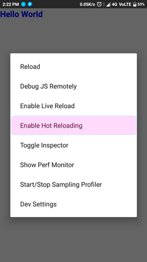

# Curso de React Native


## Tabla de Contenido

  - [Introducción](#introducción)

  - [Instalando React Native](#instalando-react-native)

  - [Hot Reload](#hot-reload)

  - [Crear un proyecto](#crear-un-proyecto)

  - [Hot Reload](#hot-reload)

  - [Usando React Native](#usando-react-native)

  - [Estilos en React Native](#rstilos-en-react-native)

  - [Setear distintos Estilos](#setear-distintos-estilos)

  - [Soporte iPhone X](#soporte-iphone-x)

  - [Estilos para imagenes en RN](#estilos-para-imagenes-en-rn)

## Introducción

`(*)` El componente `View` de native funciona como un div mientras que el componente `Text` funciona como un párrafo.

### Componentes principales de react native:

- View / ScrollView / SafeAreaView (Divs, scrolls)

- Text / TextInput (Formulario)

- Image / ImageBackground (Imágenes)
FlatList / SectionList (Listas de elementos)

- Touchable Higligth / Opacy / WithoutFeedback (Componentes para manejar los taps del teléfono)

- Animated (Sirve para animar la interfaces)

- fetch, async await, sockets (Funciones asíncronas)

- Platform (Permite identificar si es iOS o Android)

- AsyncStorage (Equivalente a localStorage)

### ¿Cuándo usar React Native?
La velocidad de desarrollo es muy importante para un equipo

### ¿Hace falta aprender Java y objetive-c?
Dile NO a la pereza. No limites aprender una tecnología por saber otra.

### ¿Cómo funciona?
React Bridge. “Convierte” el código js a código nativo.

### Developer Experience

- Hot/live reloading
- Depuración de Javascript
- Network inspector
- Stack Trace

### ¿Quiénes usan react native?

- Uber eats
- Instagram
- Facebook
- Wix
- Skype
- Pinterest
- Platzi


<div align="right">
  <small><a href="#tabla-de-contenido">🡡 volver al inicio</a></small>
</div>


## Instalando React Native

  1. Tenemos que instalar el CLI de la siguiente manera:

  ```sh
  npm install -g react-native-cli
  ```
  2. El guia mas completa de instalación lo podemos encontrar
     en [Get Started](https://facebook.github.io/react-native/docs/getting-started.html)

<div align="right">
  <small><a href="#tabla-de-contenido">🡡 volver al inicio</a></small>
</div>


## Crear un proyecto

  Para crear un nuevo proyecto se escribe los siguiente:

  ```sh
    react-native init myprojectname
  ```

  Para crear el proyecto con una versión especifica:
  ```sh
    react-native init --version="0.55.4" myprojectname
  ```

<div align="right">
  <small><a href="#tabla-de-contenido">🡡 volver al inicio</a></small>
</div>


## Hot Reload

#### Primera Opción:
  1. Realizar shake (Mover el celular izquierda a derecha).

  2. Elegir la opción de `Enable Hot Reload`

  <div align="center">
    
    <small><p>Opciones</p></small>
  </div>

  3. Listo.

#### Segunda Opción:
  Escribimos en consola:

  1. Ejecutar el proyecto:

  ```sh
  react-native run-android
  ```
  2. Abrimos otra consola y escribimos:

  ```sh
  adb shell input keyevent 82
  ```

  Este comando abrira un menu de desarrollador de ReactNative.

  3. Elegimos la opción `Enable Hot Reloading`

  <div align="center">
    
    <small><p>Opciones</p></small>
  </div>

  4. Reconectamos al servicio, escribiendo en consola:

  ```sh
  adb reverse tcp:8081 tcp:8081
  ```
  
  4. Disfruta del Hot Reload..!!


<div align="right">
  <small><a href="#tabla-de-contenido">🡡 volver al inicio</a></small>
</div>


## Usando React Native

  Si queremos cargar una imagen de una fuente externa podemos hacer:

  ```js
  <Image source={{uri:'https://misitio.com/logo.png'}}/>
  ```

  Si nuestra imagen la tenemos localmente la podemos importar con require():

  ```js
  <Image source={require('./assets/logo.png')}/>
  ```

  Estilos en React Native, se utilizan como en React, no es CSS convencional, las propiedades van con CamelCase, los valores de las propiedades pueden ser en numeros (por default me parece que los toma como pixeles), si el valor es distinto como en el caso de porcentajes, rem o em, los valores van a ser strings y van entre comillas fontSize: ‘2.5rem’. Tambien en el caso de que usemos colores en hexadecimales o un color como red o blue color: ‘#a1a1a1’.

  ```js
  <Image
    source={require('./assets/logo.png')}
    style={{width:200, height:60}}
  />
  ```

<div align="right">
  <small><a href="#tabla-de-contenido">🡡 volver al inicio</a></small>
</div>


## Estilos en React Native

  En los estilos generales de React Native se utiliza FlexBox
  para aprender más de esto ir a [Flexbox Froggy](https://flexboxfroggy.com/#es).

  Para proyectos que no requieran de estilos totalmente personalizados podemos utilizar algunos de estos paquetes para potenciar la velocidad de nuestro desarrollo cuanto estilos:

  - [Native Base](http://docs.nativebase.io/Components.html#Components) en lo personal mi favorita ya que trae una gran variedad de componentes.

  - [React Native Material UI](https://www.npmjs.com/package/react-native-material-ui), basada en el estándar Material de Google.

  - [React Native Easy Grid](https://www.npmjs.com/package/react-native-easy-grid) Este es un paquete desarrollado por los autores de Native Base, y sirve para hacer layouts bastante complejos de una manera bastante intuitiva.


<div align="right">
  <small><a href="#tabla-de-contenido">🡡 volver al inicio</a></small>
</div>


## Setear distintos Estilos
  Si quieres aplicar un estilo para android y otro para iOS simplemente
  se utiliza `Plataform`:

```css
  backgroundColor: Platform.select({
    ios: 'green',
    android: 'blue',
  }),
```

<div align="right">
  <small><a href="#tabla-de-contenido">🡡 volver al inicio</a></small>
</div>

## Soporte iPhone X

#### SafeAreaView
  Renderiza el contenido en un area segura para que el contenido
  se vea bien en todos los dispositivos principalmente los que tienen un notch.
  ```js
    <SafeAreaView>
      <Text>
        Ahora funciona en iPhoneX
      </Text>
    </SafeAreaView>
  ```

<div align="right">
  <small><a href="#tabla-de-contenido">🡡 volver al inicio</a></small>
</div>

## Estilos para imagenes en RN
  Se llama resizeMode que sería similar a background-size de css.
  
  **resizeMode** por Default esta en cover, otras opciones son:
  
  - contain
  - stretch
  - repeat
  - center.

  El padding en RN funciona un poco diferente ya que se le puede dar un padding general (top, right, bottom, left), pero si se quiere hacer solamente para right & left se tiene que hacer a mano. Para estos casos se agregan 2 opciones para utilizar:

- **paddingVertical:** esto sería lo equivalente a utilizar (_paddingTop _y paddingBottom)

- **paddingHorizontal:** esto sería lo equivalente a utilizar (_paddingRight _y paddingLeft)


<div align="right">
  <small><a href="#tabla-de-contenido">🡡 volver al inicio</a></small>
</div>